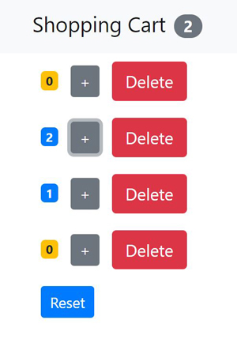

# Shopping Cart

This project was bootstrapped with [Create React App](https://github.com/facebookincubator/create-react-app).

This simple project mimics items in a shopping cart. The app allows you to increment numbers of a specific item and delete an item from the cart. Reset button resets the quantity of all items to zero. The top menu bar displays number of items with value greater than zero.

This project was created to mastering React knowledge and skills.

## How to run

1. Clone or download the repository.
2. Run `npm install` to install the project dependencies.
3. Run the app using `npm start`.
4. The app will launch in your browser at the address [http://localhost:3000/](http://localhost:3000/).

## Dependencies

1. Bootstrap

## Credits

- Tutorial [React Crash Course](https://www.youtube.com/watch?v=Ke90Tje7VS0)
